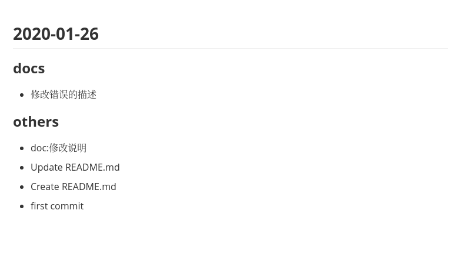

| 提交格式  | 说明                                 |
| --------- | ------------------------------------ |
| feat:     | 新增feature                          |
| fix:      | 修复bug                              |
| docs:      | 只修改了文档，比如README、设计文档等 |
| style:    | 只修改了格式，比如空格、格式缩进等   |
| refactor: | 代码重构。没有新加功能或修改功能     |
| perf:     | 优化相关。比如提升性能、体验、操作等 |
| test:     | 测试用例。比如单元测试、集成测试等   |
| chore:    | 修改构建流程、添加依赖库、工具等     |
| revert:   | 回滚代码                             |

示例

`git commit -m "fix:不能添加信息问题修复"`

使用

进入到有.git文件的同级目录执行命令

changelogs

可以自己下载golang编译成自己需要的平台命令 

效果

也可以看项目中的CHANGELOG.md文件
